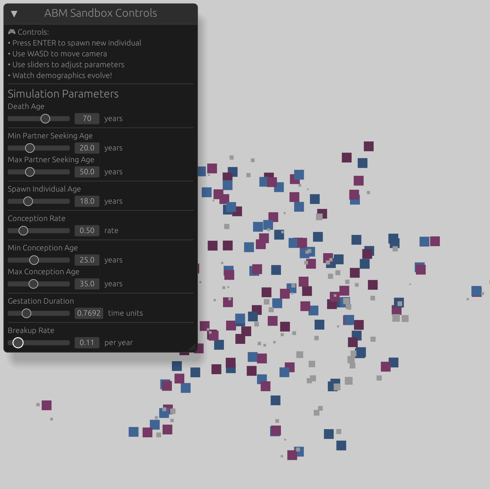

A demographic agent-based model (ABM) using [Bevy Engine](https://bevyengine.org/), with Python bindings for analysis and visualization.

## Running the Simulation

### Interactive Mode
```bash
cargo run
```

**Controls:**
- **WASD** - Move camera around the simulation area
- **Enter** - Spawn a new individual at the current camera location
- **UI Panel** - Adjust simulation parameters with sliders in real-time



### Headless Mode
```bash
cargo run --features headless [OPTIONS]
```

**Options:**
- `-n, --initial-population <NUMBER>` - Starting population size (default: 0)
- `-s, --sim-years <YEARS>` - Simulation duration in years (optional, runs indefinitely if not specified)
- `--export-events` - Export event data to JSON files (default: false)

**Examples:**
```bash
# Run with 100 initial individuals for 10 simulation years
cargo run --features headless -- --initial-population 100 --sim-years 10

# Run with 50 individuals indefinitely (Ctrl+C to stop)
cargo run --features headless -- -n 50

# Run with event export enabled
cargo run --features headless -- -n 100 -s 10 --export-events

# Show help for all options
cargo run --features headless -- --help
```

### Python Mode (Programmatic Access)

Install the Python package:
```bash
pip install -e .
```

Run simulations from Python and analyze results:
```python
import bevy_abm
import polars as pl

# Define simulation parameters
results = bevy_abm.run_simulation({
    "initial_population": 50,
    "sim_years": 20.0,
    "death_age": 70.0,
    "conception_rate": 0.5,
    "breakup_rate": 0.1
})

# Access event data as polars DataFrames
births_df = results['births']
deaths_df = results['deaths']
partnerships_df = results['partnerships']
breakups_df = results['breakups']
widowings_df = results['widowings']

# Analyze the data
print(f"Total births: {len(births_df)}")
print(f"Total partnerships: {len(partnerships_df)}")
```

See `python/analysis.ipynb` for detailed examples and visualizations.

## Configuration

### Simulation Parameters

These demographic parameters control the simulation behavior. They can be:
- Adjusted on-the-fly via UI sliders (interactive mode)
- Specified in the Python dict passed to `run_simulation()` (Python mode)

| Parameter | Description | Default | Range |
|-----------|-------------|---------|-------|
| `death_age` | Age at which individuals die | 70.0 | 20-100 |
| `min_partner_seeking_age` | Minimum age to seek partners | 20.0 | 15-30 |
| `max_partner_seeking_age` | Maximum age to seek partners | 50.0 | 40-70 |
| `min_conception_age` | Minimum age for conception | 25.0 | 18-35 |
| `max_conception_age` | Maximum age for conception | 35.0 | 25-50 |
| `conception_rate` | Annual conception rate | 0.5 | 0.1-2.0 |
| `gestation_duration` | Gestation period in time units | 0.769 | 0.5-1.5 |
| `breakup_rate` | Annual breakup rate | 0.1 | 0.0-1.0 |

### Command-Line Arguments

These control the simulation run and are available in headless and Python modes:

| Argument | Description | Default |
|----------|-------------|---------|
| `--initial-population` (or `-n`) | Starting population size | 0 |
| `--sim-years` (or `-s`) | Simulation duration in years | None (indefinite) |
| `--export-events` | Export event data to JSON files | false |

## Simulation Features

The simulation models:
- **Age-based life stages**: Individuals transition from children → adults → elders → death
- **Partner seeking and relationships**: Adults form partnerships within configurable age ranges
- **Conception and birth**: Partnered individuals can conceive and give birth
- **Breakups and widowhood**: Relationships can end through breakups or partner death
- **Visual feedback**: In interactive mode, see individuals move, form relationships, and age with color coding
- **Event tracking**: All demographic events (births, deaths, partnerships, breakups, widowings) are logged and exportable

## Dependencies

### Rust Dependencies
- **bevy** 0.13 - ECS game engine and simulation framework
- **bevy_egui** 0.27 - UI framework for interactive controls
- **rand** 0.8 - Random number generation
- **clap** 4.0 - Command-line argument parsing
- **serde/serde_json** 1.0 - JSON serialization
- **pyo3** 0.22 - Python bindings (optional, for Python feature)
- **polars** 0.43 - DataFrame library (optional, for Python feature)
- **pyo3-polars** 0.17 - Polars-Python interop (optional, for Python feature)

### Python Dependencies (for Python mode)
- **polars** ≥0.19.0 - DataFrame library for analysis
- **matplotlib** - Visualization (recommended for analysis notebook)
- **numpy** - Numerical operations (recommended for analysis notebook)

## Development

### Building
```bash
# Standard build
cargo build

# Build with Python support
cargo build --features python

# Run tests
cargo test
```

### Python Package Development
```bash
# Install in editable mode for development
pip install -e .

# Run Python tests
python python/tests/test_pybevy_demog.py
```
